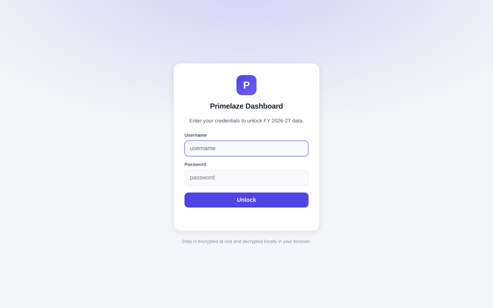
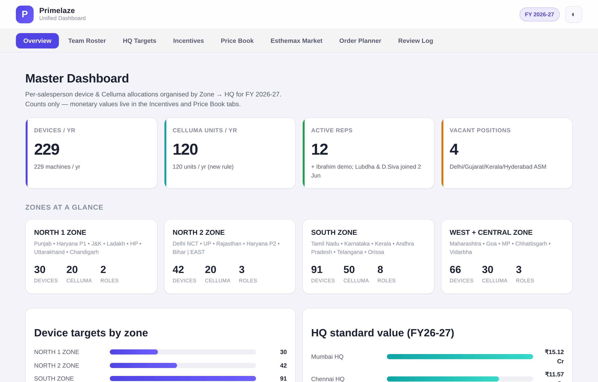

# Primelaze Unified Dashboard · FY 2026-27

A self-contained web dashboard for Primelaze's FY 2026-27 sales plan — team
roster, per-HQ device & Celluma targets, incentive schemes, the full price book,
and the Esthemax salon/doctor market pricing. It is built from two source
workbooks and runs as a **static site** with no backend and no build step.




## What's inside

| Tab | Contents |
| --- | --- |
| **Overview** | Company KPIs (229 devices, 120 Celluma, reps, vacancies), zone rollups, device-by-zone and HQ-value charts. |
| **Team Roster** | All personnel with role, **division (Derma / Salon-Spa)**, base HQ, reporting line, zone and status. Search + filter by status and division. |
| **HQ Targets** | Per-HQ FY26-27 product plans (multi-plan where an HQ has several reps), quarterly splits and highlights. **FY26-27 quantities are editable** (totals recompute live) and the plan can be **downloaded as a PDF** with the matching incentive tables and terms. |
| **Incentives** | Device value-slab, Celluma per-model and Esthemax 6-tier slab plans for both Sales Person and Manager, plus the master T&C. |
| **Price Book** | Landing / quotation / standard / minimum prices for devices, Celluma models and Esthemax skincare. |
| **Esthemax Market** | Full salon & doctor pricing matrices — old vs new (+15% MRP) structures with bulk-offer tiers and effective net prices. |
| **Inventory** | Product-line inventory & reorder planning (Esthemax loaded; Celluma / Devices are add-later). Per-SKU **sell status** (stock ≥ required → *Can sell*, else *Reorder*), required stock, minimum-order-lot buy quantity and landed money required — all recomputing live as you edit FX, customs, lot sizes and current stock. |
| **Review Log** | Every review comment raised by Surya / HR / management, with resolution and status. |

Light and dark themes, responsive layout, keyboard-free navigation, deep-linkable
tabs (`#overview`, `#incentives`, …). Every table is **click-to-sort** and has a
per-table **filter** box.

### View vs Admin mode

A header toggle switches between **View** (read-only) and **Admin** (edit). In
View mode, **landing / lending cost prices are hidden** (Price Book landing
columns, Inventory landing & money) and all editable fields are disabled. Admin
is unlocked with the site password.

> This is an interim client-side gate. Full multi-user accounts, per-user page &
> HQ permissions, and shared persistent edits are planned via **Firebase**
> (Auth + Firestore) — until then, admin edits are session-only.

## 🔒 Password protection

The dashboard is gated behind a login screen, and — because this is a static
site with no server — the protection is **real encryption, not a cosmetic form**:

- The data payload (`assets/js/data.enc.js`) is **AES-256-GCM encrypted**. The
  password is the decryption key (PBKDF2-SHA-256, 200 000 iterations).
- Nothing sensitive is readable until the correct password decrypts it *locally
  in the browser* via the Web Crypto API. Viewing page source only reveals
  ciphertext.
- A wrong password fails the GCM authentication tag — there is no plaintext
  fallback.

**Default credentials**

| Username | Password |
| --- | --- |
| `primelaze` | `prime@1986` |

### Changing the password

```bash
PRIMELAZE_PW='your-new-password' node scripts/encrypt_data.js
```

Then update `EXPECTED_USER` in `assets/js/app.js` if you also want a different
username, and commit the regenerated `assets/js/data.enc.js`.

### Security model (please read)

- Web Crypto requires a **secure context** — the site works over `https://`
  (GitHub Pages) and `http://localhost`, but **not** plain `http://` on a LAN IP.
- Strength rests entirely on password secrecy: anyone with the password can
  decrypt, and the ciphertext is downloadable, so a weak password is
  brute-forceable offline. Use a strong password for anything truly sensitive.
- The Pages workflow publishes **only** the encrypted app — the plaintext
  `data.json` and the source `.xlsx` workbooks are **never** deployed to the
  public site. They remain in the (assumed private) repository for regeneration.
  If your repository is public, remove `source_workbooks/` and `src/data/` too.

## Project structure

```
finance-primelaze/
├── index.html                 # App shell
├── assets/
│   ├── css/styles.css         # Design system (light + dark) + login screen
│   └── js/
│       ├── app.js             # Rendering / routing + login gate (vanilla JS)
│       └── data.enc.js        # GENERATED — AES-256-GCM encrypted data payload
├── src/data/data.json         # GENERATED — plaintext data (private, not deployed)
├── scripts/
│   ├── extract_data.py        # Excel → data.json
│   └── encrypt_data.js        # data.json → encrypted data.enc.js
├── source_workbooks/          # The two source .xlsx files (private, not deployed)
└── .github/workflows/pages.yml
```

## Run it locally

It's a static site — no server required.

```bash
# simplest: just open the file
open index.html            # macOS   (or: xdg-open index.html on Linux)

# or serve it (any static server works)
python3 -m http.server 8080
# → http://localhost:8080
```

Because the data is encrypted and decrypted with the Web Crypto API, serve the
site over `http://localhost` (as above) rather than opening `file://` directly —
some browsers disable Web Crypto on `file://`. GitHub Pages serves it over
`https://`, which always works.

## Regenerating the data

The app data is derived from the two workbooks in `source_workbooks/`. After
updating either workbook, re-run the extractor **and** the encryptor:

```bash
pip install openpyxl
python3 scripts/extract_data.py            # xlsx  -> src/data/data.json
node    scripts/encrypt_data.js            # data.json -> assets/js/data.enc.js
```

Commit the regenerated `assets/js/data.enc.js` (and, in a private repo,
`src/data/data.json`).

**Sources**

- `Primelaze_Unified_Dashboard_FY2627.xlsx` — master dashboard, roster,
  incentive/cost tabs and the 9 regional HQ sheets.
- `Esthemax_prices_working.xlsx` — Salon Market and Doctor Market price tables.
- `Esthemax_Order_Calculation.xlsx` — 15 months of Esthemax sales, stock levels
  and landed-cost inputs behind the Order Planner. Required stock is taken as
  authoritative from the workbook (accessory targets are manual, not derivable
  from the average); the app recomputes to-buy and money required from it.

## Deploying to GitHub Pages

A workflow at `.github/workflows/pages.yml` deploys the site on every push to
`main`. Enable it once under **Settings → Pages → Source: “GitHub Actions”**.
The published URL will be `https://<owner>.github.io/finance-primelaze/`.

## Notes

- All figures are **excluding GST** unless a column states otherwise.
- Incentives are computed on the **Standard / selling** basis, not the quotation.
- 🟡 draft cells in the source workbooks (minimums / incentives pending
  Finance verification) are carried through as-is — verify against source before
  operational use.
